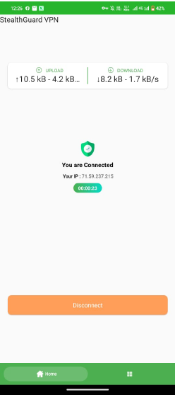
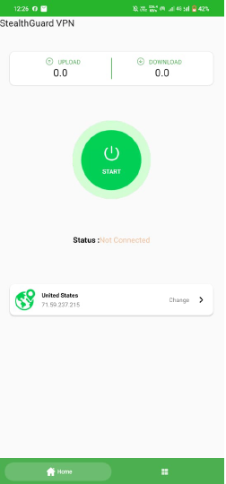
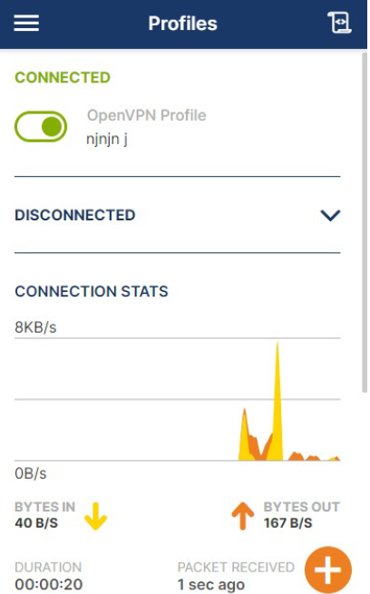

# 🛡️ StealthGuard VPN

**StealthGuard VPN** is a secure and lightweight Android-based VPN application that utilizes the **OpenVPN** protocol. This app helps protect user privacy by masking IP addresses and encrypting traffic, with a modern and user-friendly interface.
## 📱 App Preview

| Connected | Disconnected | OpenVPN Stats |

|  |  |  |

---

## 🚀 Features

- 🔒 Secure VPN connection using OpenVPN
- 🛡️ IP masking and encrypted data transmission
- 💡 Intuitive and clean user interface
- ⚙️ Easy integration of `.ovpn` profiles
- 📊 Real-time upload/download speed indicators
- 📱 Built with Android SDK (Java/Kotlin) & Gradle

---

## 📁 Project Structure
```
StealthGuardVPN/
├── app/
│   ├── src/
│   │   ├── main/
│   │   │   ├── java/com/example/stealthguardvpn/
│   │   │   │   ├── MainActivity.java
│   │   │   │   └── MyVpnService.java
│   │   │   ├── res/
│   │   │   └── assets/userrrr.ovpn
│   └── build.gradle.kts
├── build.gradle.kts
├── settings.gradle.kts
└── gradle.properties
```

## Getting Started

### Prerequisites

- Android Studio (Arctic Fox or higher recommended)
- Android SDK (API level 26+)
- Internet connection for dependency resolution

### How to Run

1. Clone or download the project.
2. Open the project in Android Studio.
3. Sync the Gradle files.
4. Replace `userrrr.ovpn` with your valid `.ovpn` file if needed.
5. Build and run the app on a physical Android device or emulator.

## Permissions

Make sure to include the following permissions in your `AndroidManifest.xml` if not already present:
```xml
<uses-permission android:name="android.permission.INTERNET" />
<uses-permission android:name="android.permission.FOREGROUND_SERVICE" />
```

## License

This project is licensed under the MIT License - see the [LICENSE](LICENSE) file for details.

---

**Disclaimer**: This project is for educational purposes only. Use it responsibly and ensure compliance with legal regulations in your region.
